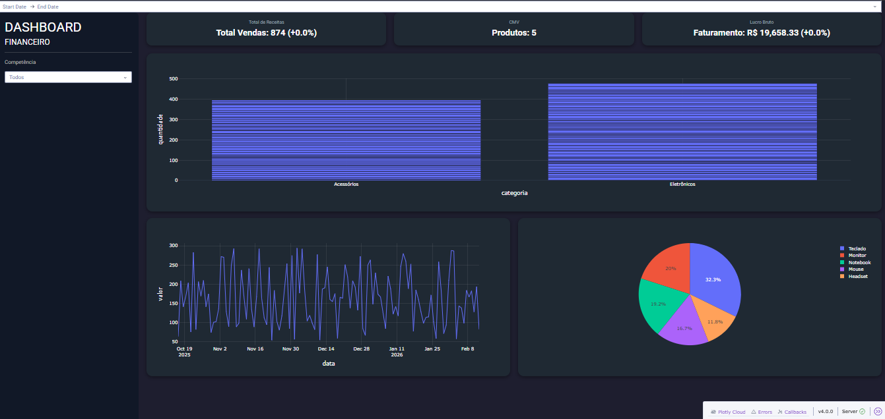

📊 Dashboard BI – Business Intelligence com Python & Dash

Dashboard interativo de Business Intelligence desenvolvido em Python utilizando Dash, Plotly e PostgreSQL, focado em análise de vendas, indicadores financeiros e comparação de períodos.

O projeto demonstra domínio de:

Modelagem de dados

Consumo de banco de dados

Visualização interativa

Arquitetura modular

Indicadores de desempenho (KPIs)

Análise comparativa entre períodos

🚀 Funcionalidades

KPIs financeiros:

Total de Vendas

Quantidade de Produtos

Faturamento

Comparação automática com período anterior (%)

Filtros interativos:

Produto

Intervalo de datas

Gráficos:

Barras

Linha

Pizza

Atualização automática (refresh)

Layout responsivo

Arquitetura modular (layout, callbacks, serviços, utils)


```text
Dasboard-BI/
│
├── app.py                  # Arquivo principal (start do projeto)
├── app_instance.py         # Instância do Dash
│
├── layouts/
│   ├── __init__.py
│   └── layout.py           # Layout da interface
│
├── callbacks/
│   ├── __init__.py
│   └── dashboard_callbacks.py
│
├── services/
│   └── kpi_service.py      # Cálculos de período e variação
│
├── utils/
│   ├── data_source.py      # Funções de acesso ao banco
│   └── db_connection.py   # Conexão com PostgreSQL
│
├── requirements.txt
└── README.md
```
